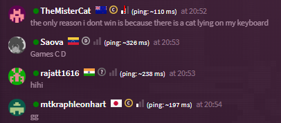

# fightcade-plugin-chat-user-info
Plugin to display status, country, rank, and ping next to the name of users in Fightcade chat. 

All credit goes to [Ren](https://x.com/rencoding). This is a direct port of the same code included in their [Fightcade Renhanced Plugins](https://github.com/Arkadyzja/fcade-renhanced), just extracted to work with the [fightcade-plugin-manager](https://github.com/nmur/fightcade-plugin-manager).

[](./img/image.png)

## Installation

If you have not done so already, download and install the [fightcade-plugin-manager](https://github.com/nmur/fightcade-plugin-manager).

Download `chatUserInfo.js` from the latest [release](https://github.com/nmur/fightcade-plugin-chat-user-info/releases) and place it in your `Fightcade\fc2-electron\resources\app\inject\plugins` directory.

## Configuration
To modify the values to enable/disable each info component, add the following to the `plugins\config.json`:
```json
{
    "chatUserInfo": {
        "enableStatus": true,
        "enableFlag": true,
        "enableRank": false,
        "enablePingText": true,
        "enablePingBars": false
    },
}
```

## Limitations

When used alongside the [fightcade-plugin-ping-filter](https://github.com/nmur/fightcade-plugin-ping-filter), the Rank and Ping Bars are not shown for users that have been filtered out.
